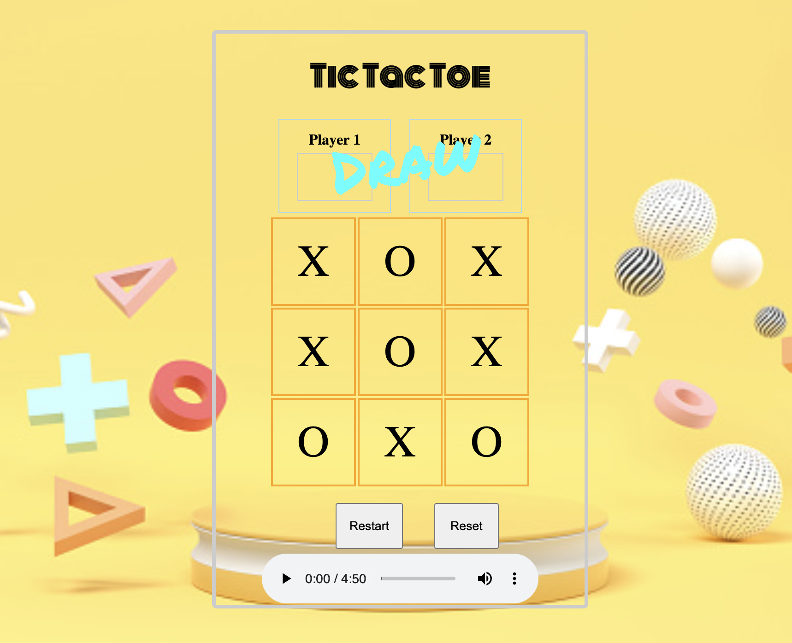

# TicTacToe

https://happysonia.github.io/TicTacToe/

Tic-tac-toe is a game in which two players take turns in drawing either an ' O' or an ' X' in one square of a grid consisting of nine squares. The winner is the first player to get three of the same symbols in a row.

## tech used

HTML,CSS,Javascript

## lessons learned

Javascript

## future features

Extend the 9 grids to multiple grids board.
